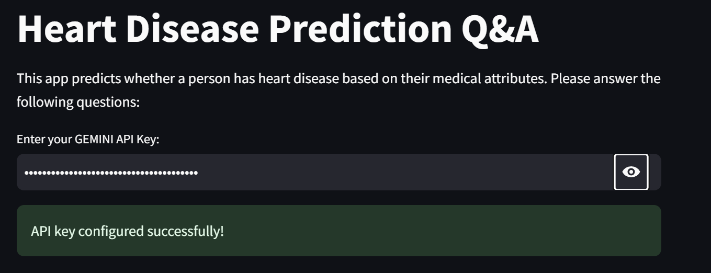

# ❤️ Heart Sense 


An Heart Disease Prediction Website

[](https://basic-template.streamlit.app/)

### How to run it on your own machine

1. Install the requirements

   ```
   pip install -r requirements.txt
   ```

2. Run the app

   ```
   streamlit run streamlit_app.py
   ```
3. Get started with the Gemini API
   1. Go to [Google AI Studio](https://aistudio.google.com/).
   2. Login with your Google account.
   3. [Create](https://aistudio.google.com/app/apikey) an API key.
   4. Try a Python SDK [quickstart](https://github.com/google-gemini/gemini-api-cookbook/blob/main/quickstarts/Prompting.ipynb) in the [Gemini API Cookbook](https://github.com/google-gemini/gemini-api-cookbook/).
   5. For detailed instructions, try the 
[Python SDK tutorial](https://ai.google.dev/tutorials/python_quickstart) on [ai.google.dev](https://ai.google.dev).
 4.  Paste you gemini api key
     
